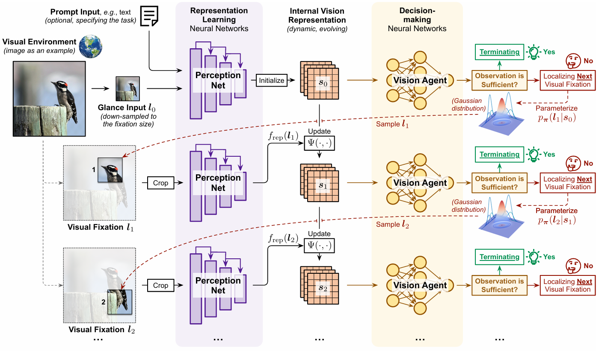

# AdaptiveNN (NMI'25)

This repo contains the official code and pre-trained models for the *Nature Machine Intelligence* paper **"Emulating Human-like Adaptive Vision for Efficient and Flexible Machine Visual Perception"**

<p align="center">

</p>


## Environment
Install [PyTorch](https://pytorch.org/)>=2.0.0 and [torchvision](https://pytorch.org/vision/stable/index.html) following official instructions. For example:
```
pip install torch==2.0.0 torchvision -f https://download.pytorch.org/whl/torch_stable.html
```

Install the required packages:
```
pip install -r requirements.txt
```

## Dataset
Download the [ImageNet-1K](http://image-net.org/) classification dataset and structure the data as follows:
```
/path/to/imagenet-1k/
  train/
    class1/
      img1.jpeg
    class2/
      img2.jpeg
  val/
    class1/
      img3.jpeg
    class2/
      img4.jpeg
```

## Training

As a representative example, we provide the ImageNet-1K training command of AdaptiveNN-DeiT-S here.

```
python -m torch.distributed.launch --use-env --nproc_per_node=8 --master_port=12345 main_ppo.py \
    --data_path <PATH_TO_IMAGENET> \
    --output_dir <PATH_TO_SAVE_LOGS> \
    --model dynamic_deitS \
    --lr 4e-3 --batch_size 512 --seq_l 4 --clip_grad 5.0 \
    --input_size 288 --glance_input_size 112 --focus_patch_size 112 \
    --focus_net_reg_size 160 --loss_reg_focus_net_weight 2.0 \
    --gamma 0.5 --ppo_lam 0.84 --ppo_update_steps 5 --update_policy_freq 10
```

## Evaluation
Our pretrained model can be downloaded from [this link](https://drive.google.com/file/d/1OIPZyTozJatdd40VZKaJHsw0ShaujQ0Y/view?usp=sharing). Evaluate the pretrained model with the following command:
```
python -m torch.distributed.launch --use-env --nproc_per_node=1 --master_port=12375 main_ppo.py \
    --data_path <PATH_TO_IMAGENET> \
    --output_dir <PATH_TO_SAVE_LOGS> \
    --model dynamic_deitS \
    --lr 4e-3 --batch_size 512 --seq_l 4 --clip_grad 5.0 \
    --input_size 288 --glance_input_size 112 --focus_patch_size 112 \
    --focus_net_reg_size 160 --loss_reg_focus_net_weight 2.0 \
    --gamma 0.5 --ppo_lam 0.84 --ppo_update_steps 5 --update_policy_freq 10 \
    --eval true --resume <PATH_TO_CKPT>
```

## Acknowledgements
This repository is built using the [timm](https://github.com/huggingface/pytorch-image-models) library and [ConvNeXt](https://github.com/facebookresearch/ConvNeXt) repository.

## Reference
If you find our code or papers useful for your research, please cite:
```
@article{wang2025emulating,
  title={Emulating Human-like Adaptive Vision for Efficient and Flexible Machine Visual Perception},
  author={Wang, Yulin and Yue, Yang and Yue, Yang and Wang, Huanqian and Jiang, Haojun and Han, Yizeng and Ni, Zanlin and Pu, Yifan and Shi, Minglei and Lu, Rui and Yang, Qisen and Zhao, Andrew and Xia, Zhuofan and Song, Shiji and Huang, Gao},
  journal={Nature Machine Intelligence},
  year={2025},
  publisher={Nature Publishing Group UK London}
}
```


## Contact
If you have any question, feel free to contact the authors.

Yulin Wang: wang-yl19@mails.tsinghua.edu.cn

Yang Yue: le-y22@mails.tsinghua.edu.cn

Yang Yue: yueyang22@mails.tsinghua.edu.cn